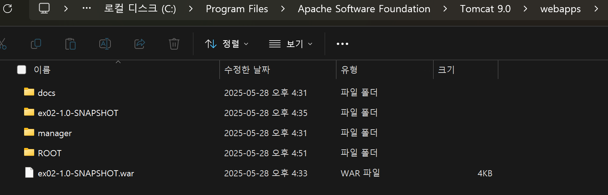

# 웹 어플리케이션 프로젝트(심화1)

## 1.앞에서 만든 프로젝트를 war 파일로 만드세요.


## 2.앞에서 만든 war 파일을 tomcat의 root 어플리케이션으로 배포하세요.



```
conf/server.xml에 입력
<host>
...
<Context path="/" docBase="ex02-1.0-SNAPSHOT" reloadable="false" > </Context>

</host>

```

- startup.bat 실행
- localhost:8080/ 입력 후 확인인
