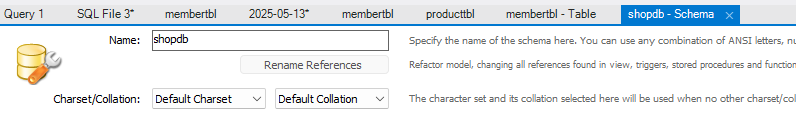
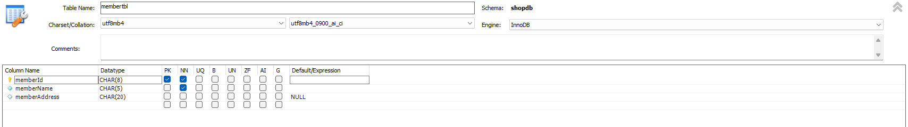
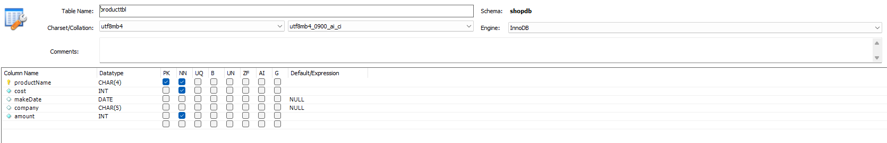
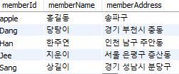
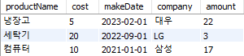

# MySQL 전체 운영 실습(기본)

## 1.워크벤치의 GUI를 이용하여 shopdb 데이터베이스를 정의하세요. 작성 결과를 화면 캡처 하세요.



## 2.워크벤치의 GUI를 이용하여 다음 테이블을 정의하세요. 작성 결과를 화면 캡처 하세요.




## 3.워크벤치의 GUI를 이용하여 다음 테이블에 데이터를 추가하세요. 작성 결과를 화면 캡처 하세요.




## 4.워크벤치의 GUI를 이용하여 memberTBL에 데이터를 하나 추가하세요. 작성 결과를 화면 캡처 하세요.

```sql
 INSERT INTO `shopdb`.`membertbl` (`memberId`, `memberName`, `memberAddress`) VALUES ('tester', '테스터', '광진구');
```

## 5.앞에서 추가한 데이터를 삭제하세요.

```sql
 DELETE FROM `shopdb`.`membertbl` WHERE (`memberId` = 'tester'); -- sql에서 = 는 비교연산자
```

## 6.productTBL의 데이터를 출력하세요.

```sql
select * from shopdb.producttbl;
```

## 7.memberTBL의 데이터를 출력하세요.

#### 단, memberName과 memberAddress 만 출력함

```sql
select memberName,memberAddress From membertbl;
```

## 8.memberTBL의 데이터 중 이름이 '지운이'인 데이터만 출력하세요.

```sql
select * from memberTBL where memberName = '지운이';
```
